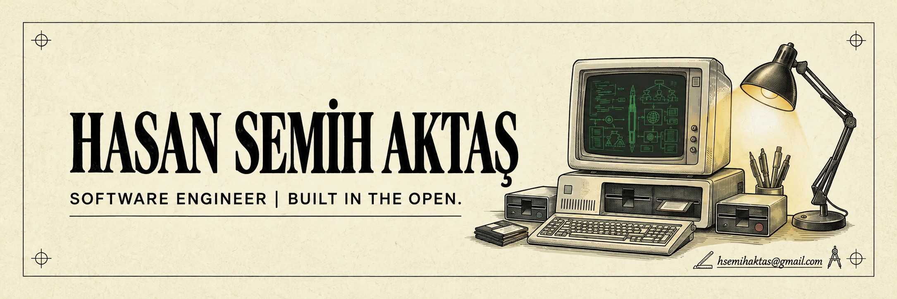
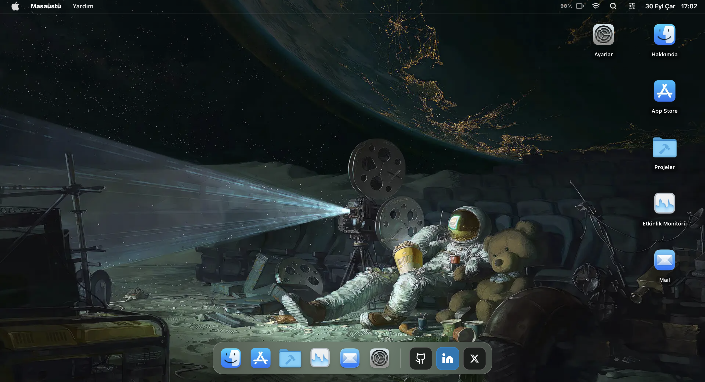
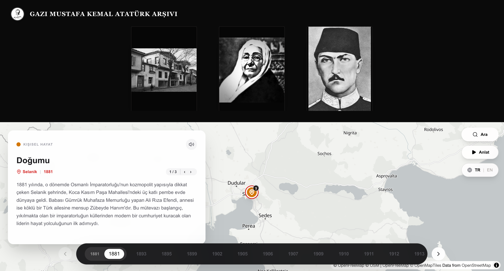
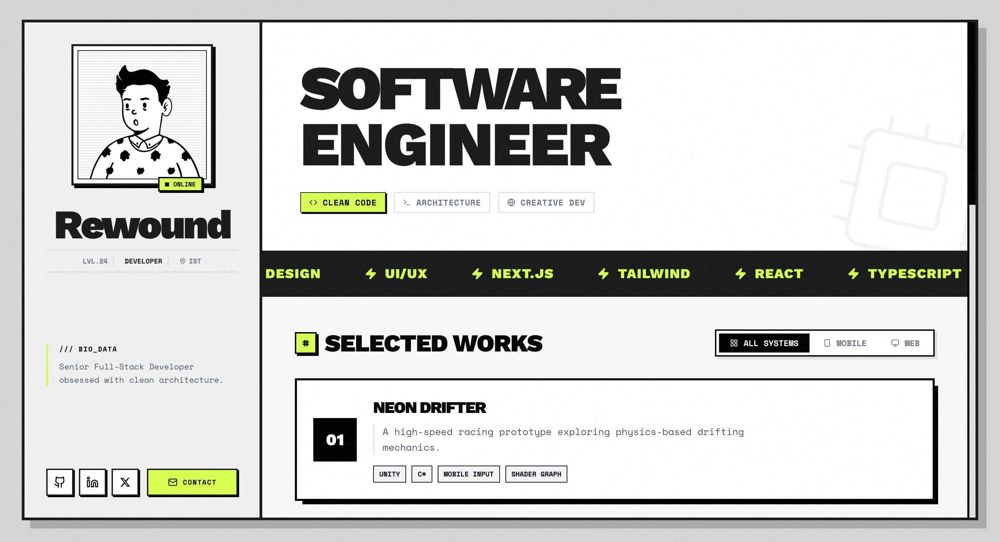
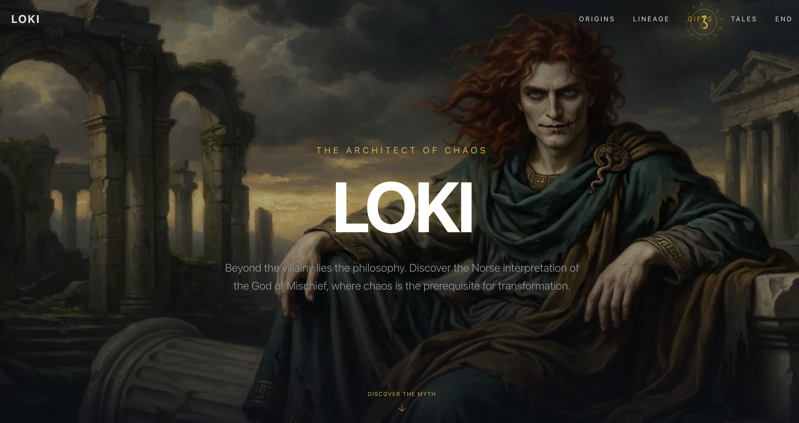

  

<h1>Hasan Semih Aktaş 👋</h1>

  

  
  
  

  Istanbul, Turkey · <a href="https://hsemihaktas.vercel.app/" target="_blank" rel="noopener">hsemihaktas.vercel.app</a>

---

## About

Mobile & Full-Stack Developer with 3+ years building production-ready
cross-platform apps. I work mostly in **React Native and Expo**, and lately most
of my time goes into **AI features inside real products** — shipping to the App
Store and Google Play rather than stopping at a prototype.

- 🔭 Currently building — _AI-powered mobile apps with Google Gemini & on-device models_
- 🌱 Currently learning — _computer vision, edge functions, and better model integration_
- 💬 Ask me about — _React Native, Expo, TypeScript, Next.js, LLM integration, CI/CD_
- ⚡ Fun fact — _I spent a whole sprint making one transition feel right. It was worth it._

---

## Stack

---

## Projects

<table>
  <tr>
    <td width="50%" valign="top" align="center">
      
      <h3>Personal Website</h3>
      
My portfolio and the place most of my side experiments end up.

      
<a href="https://hsemihaktas.vercel.app/" target="_blank" rel="noopener">Visit ↗</a>

    </td>
    <td width="50%" valign="top" align="center">
      
      <h3>Effease — AI Photo Studio</h3>
      
AI photo editor with 50+ real-time transformations built on Google Gemini 2.5 Flash. Live on iOS, Android and web.

      
<code>React Native</code> <code>Expo</code> <code>Supabase</code>

    </td>
  </tr>
</table>

<table>
  <tr>
    <td width="50%" valign="top" align="center">
      
      <h3>Encrypt Diary</h3>
      
Privacy-first notes with AES-256 encryption via <code>expo-crypto</code> and key-based access control.

      
<code>React Native</code> <code>Expo</code> <code>TypeScript</code>

    </td>
    <td width="50%" valign="top" align="center">
      
      <h3>Atatürk History</h3>
      
An interactive timeline of Atatürk's life and the early Turkish Republic.

      
<code>Next.js</code> <code>TailwindCSS</code> <code>Maps</code>

    </td>
  </tr>
</table>

<table>
  <tr>
    <td width="50%" valign="top" align="center">
      
      <h3>Rewound</h3>
      
My portfolio and writing — a home for the things I build after hours.

      
<code>Next.js</code> <code>TypeScript</code> <code>TailwindCSS</code>

    </td>
    <td width="50%" valign="top" align="center">
      
      <h3>Loki History</h3>
      
A cinematic dive into Norse mythology with an interactive genealogy tree and parallax storytelling.

      
<code>Next.js 16</code> <code>TailwindCSS 4</code>

    </td>
  </tr>
</table>

  
<b>More projects</b>

   

<table>
  <thead>
    <tr>
      <th align="left">Project</th>
      <th align="left">What it does</th>
      <th align="left">Stack</th>
    </tr>
  </thead>
  <tbody>
    <tr>
      <td><b>FaceRateMax AI</b></td>
      <td>On-device facial analysis and scoring with TensorFlow Lite — no server round trip</td>
      <td>React Native · TFLite</td>
    </tr>
    <tr>
      <td><b>Task Flow</b></td>
      <td>SaaS Kanban with role-based access, drag-and-drop and real-time collaboration</td>
      <td>Next.js · Supabase · PostgreSQL</td>
    </tr>
    <tr>
      <td><b>ALT F5</b></td>
      <td>Cyberpunk media platform: full-screen comic reader, podcast hub, indie game arcade</td>
      <td>Next.js 16 · Zustand · Framer Motion</td>
    </tr>
    <tr>
      <td><b>The Void</b></td>
      <td>Space-themed exploration site — vacuum energy, time dilation, dark cinematic UI</td>
      <td>Next.js · Framer Motion</td>
    </tr>
    <tr>
      <td><b>E-Commerce</b></td>
      <td>Multi-vendor marketplace with real-time analytics, inventory and low-stock alerts</td>
      <td>Next.js · Firebase · TailwindCSS</td>
    </tr>
    <tr>
      <td><b>Beauty Center</b></td>
      <td>Mobile booking with live availability, push notifications and photo reviews</td>
      <td>React Native · Expo</td>
    </tr>
    <tr>
      <td><b>BlurFace</b></td>
      <td>AI face detection and blurring for images and video via OpenCV</td>
      <td>Python · Django</td>
    </tr>
  </tbody>
</table>

---

  
  
  

